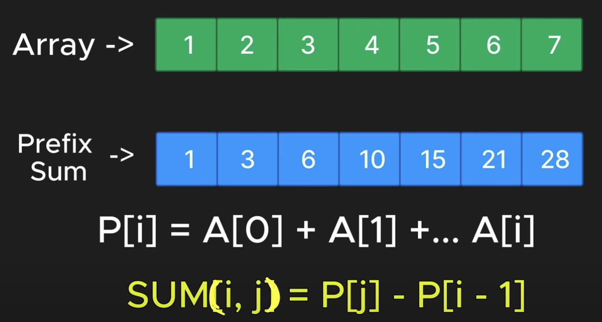
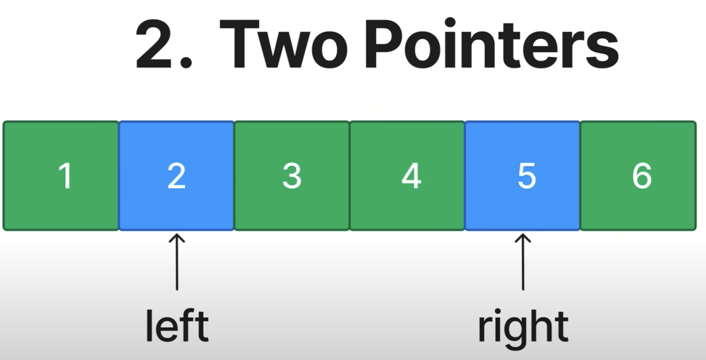
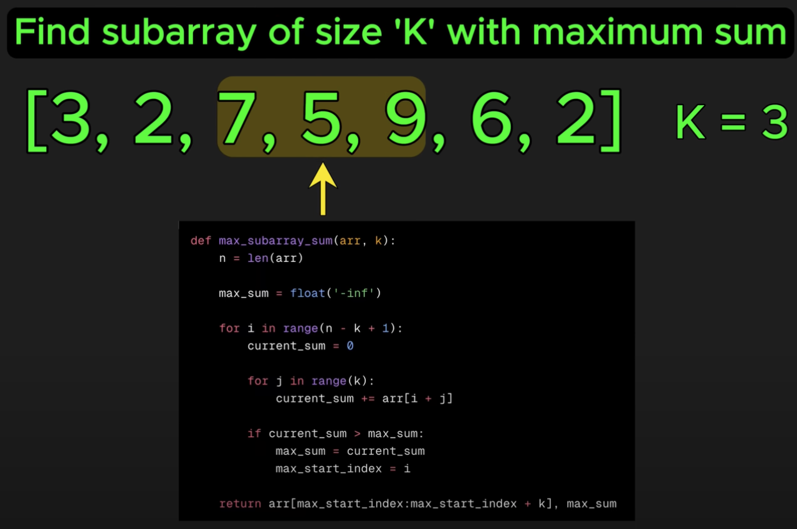
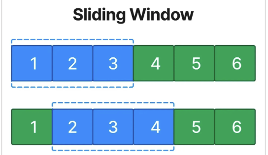

# Time complexity and Big-O Notation

Time complexity describes how the execution time of an algorithm grows relative to the input size. We use Big-O notation to express this relationship mathematically.

Below are the most common time complexities.

## O(1) - Constant time
Operations that take the same amount of time regardless of input size.

## O(log n) - Logarithmic time

A logarithm answers the question "How many times do I need to multiply a base number by itself to get the target number?"

| Power of 2 (just for reference) | Log₂ |
|------------|------|
| 2¹ = 2     | 1    |
| 2² = 4     | 2    |
| 2³ = 8     | 3    |
| 2⁴ = 16    | 4    |
| 2⁵ = 32    | 5    |
| 2⁶ = 64    | 6    |
| 2⁷ = 128   | 7    |

Notice how the input grows exponentially (2, 4, 8, 16...), but the logarithm value (the result) grows linearly (1, 2, 3, 4...).


* The curve rises quickly for small input sizes but dramatically flattens as input size increases
* If your input size doubles, your algorithm only needs one additional operation.
* For a binary search on an array:  
    10 elements ≈ log₂(10) ≈ 3.32 steps (max)  
    1,000 elements ≈ log₂(1000) ≈ 10 steps (max)  
    1,000,000 elements ≈ log₂(1,000,000) ≈ 20 steps (max)  
    O(log n) Is Efficient.  
This is why search algorithms like binary search, balanced binary search trees - they scale exceptionally well as data size increases.

## O(n) - Linear time
Operations that process each element in the input exactly once. The execution time grows linearly with the input size. It examines each element exactly once, regardless of the array's content or order.

## O(n log n) - Linearithmic Time
This complexity often appears in efficient sorting algorithms like Merge Sort, Quick Sort, and Heap Sort. Linearithmic time complexity combines linear and logarithmic growth rates. 


## O(n<sup>2</sup>) - Quadratic Time
Operations that involve nested iterations over the input. Example bubble sort.

## O(2<sup>N</sup>)

## O(N!)


## Summary


# Patterns to solve code challenges
1. Prefix sum  
      
    Reuse the same array 👇
    ```python
    def crate_prefix_sum(arr):
        for i in range(1, len(arr)):
            arr[i] += arr[i-1]
        return arr
    ```
2. Two pointers  


Eg: Palidrome
"a b c d c b a"
start end
```python
def is_palidrome(string):
    start = 0
    end = len(string) -1
    while start < end:
        if string[start] != string[end]:
            return False
        satrt += 1
        end -= 1
    return True
```
3. Sliding window  
In the case like below brute force approach, sliding window technique can be used.  
  
  
```python
def max_subarray_sum_sliding_window(arr, k):
    n = len(arr)
    window_sum = sum(arr[:k])

    max_sum = window_sum
    max_start_index = 0

    for i in range(n - k):
        window_sum = window_sum - arr[i] + arr[i + k]
        if window_sum > max_sum:
            max_sum = window_sum
            max_start_index = i + 1
    return arr[max_start_index:max_start_index + k], max_sum
```

4. Fast and Slow pointers  

5. LinkedList In-place reversal
6. Monotonic stack
7. Top 'K' Elements
8. Overlapping Intervals
9. Modified Binary Search
10. Binary Tree Traversal
11. Depth-First Search (DFS)
12. Breadth-First Search (BFS)
13. Matrix Traversal
14. Backtracking
15. Dynamic Programming Patters
